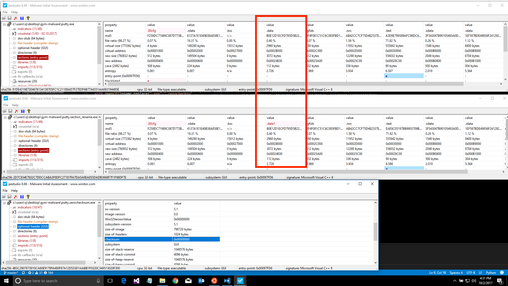

# mutateEXE
A fork of [Endgame's gym-malware](https://github.com/endgameinc/gym-malware) manipulate2.py for stand-alone file mutation without the machine-learning stuff.

# Purpose
I wanted to a way to mutate PE (exe) files in such a way that it will still remain functional for the purpose of testing endpoint security products, particularly the so call next-generation machine/deep learning based products.

# Prior Work
I chanced upon Dr Hyrum Anderson's [presentation @ DEF-CON - Evading next-gen AV using A.I](https://media.defcon.org/DEF%20CON%2025/DEF%20CON%2025%20presentations/DEFCON-25-Hyrum-Anderson-Evading-Next-Gen-AV-Using-AI.pdf) & within his work, the ability to mutate the PEs but maintain functionality is exactly what I was looking for.

# Problems Encountered
[LIEF](https://lief.quarkslab.com) has some [parsing issue](https://github.com/endgameinc/gym-malware/issues/1) as eluded by Dr Hyrum. He shared that only some files are affected; those that are malformed to begin with, which can be common for malware samples.

Somehow, **every EXE** I loaded into a byte-array will always fail to parse with **lief.PE.parse()** function. I tested in both OSX & Windows10 with native Bash integration.

So I hacked his scripts to load via filename string, parsing sort-of work. Even after I gotten the script to parse, **ALL the rebuilt PEs will end up as "brick" files which cannot be executed**. 

# Work Arounds
## Parsing
After looking at [Quarkslab documentation](https://lief.quarkslab.com/doc/api/python/pe.html#parser), I realized the parse function has overloads. Changing the PE parse calls within [manipulate2.py](manipulate2.py) to lief.PE.parse(self.bytez, **name=''**) solves the parsing EXE issue. This eliminates overload function call confusion.

## PE Building
The original [__binary_to_bytez](https://github.com/endgameinc/gym-malware/blob/c51438384323d286ceb0f6f526f24263e09b6277/gym_malware/envs/controls/manipulate2.py#L36) will always call build.build_* functions even if the various flags are false. After glancing through Quarkslab docs, it seems those functions will rebuild the various structures within the given PE. By right, nothing should happen if those functions were invoked with False as parameters. Unfortunately for unknown reasons, it breaks the rebuilt files.

Most of the build_* functions are unnecessary if we only want to change sections (rename, append...), zero-out checksum & remove certificate within the PE. After generating the mutate files, I used a PE analysis tool to check if changes were written to the new file:

# Installation
Please follow [Endgame's gym-malware](https://github.com/endgameinc/gym-malware) instruction to get LIEF lib & Python bindings to work first. 

# Usage
I highly suggest using Windows 10 with Bash integration for such development & testing. If you are mutating malicious PEs, **you should probably run ["removeInvalidPE.ps1"](removeInvalidPE.ps1) within the same folder as those mutated files within a test Windows VM** with Powershell to delete all the invalid executable-files

# Observations
* I mutated 4 Win32 GUI PEs with the mutation actions within mutate.py so far & the resultant files tend to work fine. 

* Win32 console PEs are more unpredictable, so I wrote a Powershell to remove the invalid output mutated files

* So far, most of the Windows native EXEs I lifted from C:\Windows\System32 will tend to break after mutation. 